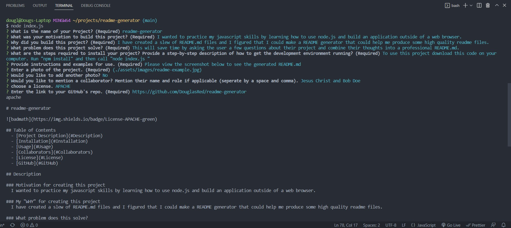

# readme-generator

## Table of Contents
  - [Project Description](#Description)
  - [Installation](#Installation)
  - [Usage](#Usage)
  - [Collaborators](#Collaborators)
  - [License](#License)
  - [GitHub](#GitHub)

## Description

### Motivation for creating this project
  I wanted to practice my javascript skills by learning how to use node.js and build an application outside of a web browser.

### My "WHY" for creating this project
  I have created a slew of README.md files and I figured that I could make a README generator that could help me produce some high quality readme files.

### What problem does this solve?
  This will save time by asking the user a few questions about their project and combine their thoughts into a professional README.md.

## Installation
  To use this project download this code on your computer. Run "npm install" and then call "node index.js "

## Usage
  Please view the screenshot below to see the generated README.md

  

## Collaborators
  John Doe

## License
  Licensed under the [MOZILLA](https://choosealicense.com/licenses/mpl-2.0/) license

## GitHub
  https://github.com/DouglasRed/readme-generator

